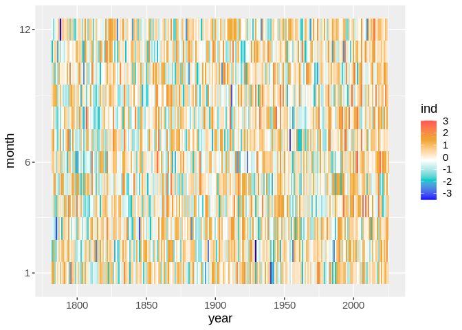
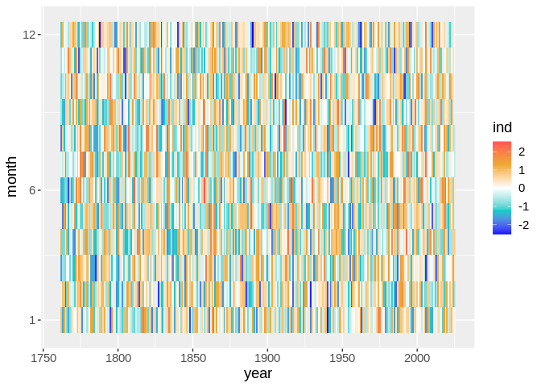
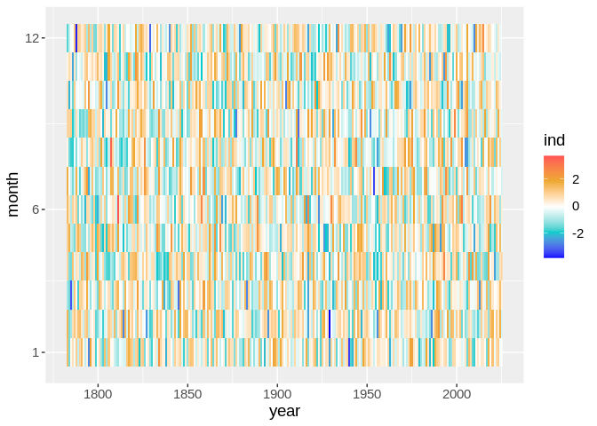

## Work with yearly and moving/rolling 30y normalization


```r
require("ggplot2")
```

```
## Loading required package: ggplot2
```

```
## Registered S3 methods overwritten by 'tibble':
##   method     from  
##   format.tbl pillar
##   print.tbl  pillar
```

```r
color.temperature <- c("#0000FF", "#00CCCC", "#FFFFFF", "#EEAA33", "#FF5555")
#install.packages("data.table")
library(data.table)
#install.packages("zoo")
library(zoo)
```

```
## 
## Attaching package: 'zoo'
```

```
## The following objects are masked from 'package:base':
## 
##     as.Date, as.Date.numeric
```

```r
library(rollRegres)


tmDwd <- read.csv("https://raw.githubusercontent.com/climdata/baur/master/csv/baur_monthly.csv", sep=",")
tmbCompl <- read.csv("https://raw.githubusercontent.com/climdata/glaser2010/master/csv/ti_1500_2xxx_monthly.csv", sep=",", na = "NA")
tmbCompl$ts <- signif(tmbCompl$year + (tmbCompl$month-0.5)/12, digits=6)
#tempFull <- tempCompl[,c("year","month","ti")]

#1949, Nov
#py3[1199,5] = 88.0 

rollingAVG <- function(data,mon,wid) {
  py4 <-  subset(data, (data$year>1752 & data$month == mon)) 
  avg <- rollapply(py4$temperature, width=wid, by=1, FUN=mean) 
  std <- rollapply(py4$temperature, width=wid, by=1, FUN=sd)
  py4 <-tail(py4, n=1-wid)
  py4$ind <- (py4$temperature - avg)/std
  py4$ind <- signif(py4$ind, digits=6)
  return(py4)   
}


tia30 <- rollingAVG(tmDwd,1,30)
for (mont in c(2,3,4,5,6,7,8,9,10,11,12)) {
  tmp <-rollingAVG(tmDwd,mont,30)
  tia30 <- rbind(tia30, tmp)
}
#tia30 <- tia30[order(tia30$ts),]
norm <- tia30

mp <- ggplot(norm, aes(year, month))
mp + geom_raster(aes(fill=ind))+
  scale_y_continuous(breaks=c(1,6,12))+
  theme(panel.background = element_rect(fill = '#EEEEEE', colour = 'white'), legend.position="right", text=element_text(size=14))+
  scale_fill_gradientn(colours=color.temperature)
```

<!-- -->

```r
#hist(norm$temperature)

tmb <- subset(tmbCompl, tmbCompl$ts<min(tia30$ts-0.01)) 
names(tmb)[names(tmb) == "ti"] <- "tia30"
names(tia30)[names(tia30) == "ind"] <- "tia30"
tia30$temperature = NULL
tia30 = rbind(tia30, tmb)
#tia30 <- tia30[order(tia30$ts),]
```


## Work with yearly and moving/rolling 10y normalization


```r
tia10 <- rollingAVG(tmDwd,1,10)
for (mont in c(2,3,4,5,6,7,8,9,10,11,12)) {
  tmp <-rollingAVG(tmDwd,mont,10)
  tia10 <- rbind(tia10, tmp)
}

norm <- tia10


mp <- ggplot(norm, aes(year, month))
mp + geom_raster(aes(fill=ind))+
  scale_y_continuous(breaks=c(1,6,12))+
  theme(panel.background = element_rect(fill = '#EEEEEE', colour = 'white'), legend.position="right", text=element_text(size=14))+
  scale_fill_gradientn(colours=color.temperature)
```

<!-- -->

```r
#hist(norm$temperature)

tmb <- subset(tmbCompl, tmbCompl$ts<min(tia10$ts-0.01))
names(tmb)[names(tmb) == "ti"] <- "tia10"
names(tia10)[names(tia10) == "ind"] <- "tia10"
tia10$temperature = NULL
tia10 = rbind(tia10, tmb)
#tia10 <- tia10[order(tia10$ts),]
```


## Work with yearly and moving/rolling 10y linearization


```r
#install.packages("data.table")

rollingGLM <- function(data, mon, wid) {
  py4 <-  subset(data, (data$year>1752 & data$month == mon))
  reg <- roll_regres(temperature ~ year, py4, width = wid, do_compute=c('sigmas', '1_step_forecasts')) 
  #reg <- roll_regres(temperature ~ year, py4, width = wid, do_compute=c('sigmas'))
  lapply(reg, tail)
  py4$ind <- (py4$temperature - reg$one_step_forecasts)/reg$sigmas  
  py4$ind <- signif(py4$ind, digits=6)
  #py4$ind2 <- (py4$temperature - py4$year*reg$coefs[,2]+reg$coefs[,1])/reg$sigmas
  
  py4 <-tail(py4, n=-wid)
  return(py4) 
}  

til10 <- rollingGLM(tmDwd,1,10)
for (mont in c(2,3,4,5,6,7,8,9,10,11,12)) {
  tmp <-rollingGLM(tmDwd,mont,10)
  til10 <- rbind(til10, tmp)
}

#py5 <-tail(py5, n=-10)
norm <- til10

mp <- ggplot(norm, aes(year, month))
mp + geom_raster(aes(fill=ind))+
  scale_y_continuous(breaks=c(1,6,12))+
  theme(panel.background = element_rect(fill = '#EEEEEE', colour = 'white'), legend.position="right", text=element_text(size=14))+
  scale_fill_gradientn(colours=color.temperature)
```

<!-- -->

```r
#hist(norm$temperature)
#hist(norm$ind)

tmb <- subset(tmbCompl, tmbCompl$ts<min(til10$ts-0.01))
names(tmb)[names(tmb) == "ti"] <- "til10"
names(til10)[names(til10) == "ind"] <- "til10"
til10$temperature = NULL
til10 = rbind(til10, tmb)
#til10 <- til10[order(til10$ts),]
```


## Work with yearly and moving/rolling 30y linearization


```r
til30 <- rollingGLM(tmDwd,1,30)
for (mont in c(2,3,4,5,6,7,8,9,10,11,12)) {
  tmp <-rollingGLM(tmDwd,mont,30)
  til30 <- rbind(til30, tmp)
}

#py5 <-tail(py5, n=-10)
norm <- til30

mp <- ggplot(norm, aes(year, month))
mp + geom_raster(aes(fill=ind))+
  scale_y_continuous(breaks=c(1,6,12))+
  theme(panel.background = element_rect(fill = '#EEEEEE', colour = 'white'), legend.position="right", text=element_text(size=14))+
  scale_fill_gradientn(colours=color.temperature)
```

<!-- -->

```r
#hist(norm$temperature)
#hist(norm$ind)

tmb <- subset(tmbCompl, tmbCompl$ts<min(til30$ts-0.01))
names(tmb)[names(tmb) == "ti"] <- "til30"
names(til30)[names(til30) == "ind"] <- "til30"
til30$temperature = NULL
til30 = rbind(til30, tmb)
#til30 <- til30[order(til30$ts),]
```


## Work with yearly and fixed normalization


```r
tis99 <-  subset(tmDwd, (tmDwd$year>1752 & tmDwd$month == 1)) 

avg <- mean(tis99$temperature, na.rm = TRUE)
std <- sd(tis99$temperature, na.rm = TRUE)
tis99$ind <- (tis99$temperature-avg)/std

for (mont in c(2,3,4,5,6,7,8,9,10,11,12)) {
  tmp <-subset(tmDwd, (tmDwd$year>1752 & tmDwd$month == mont)) 
  avg <- mean(tmp$temperature, na.rm = TRUE)
  std <- sd(tmp$temperature, na.rm = TRUE)
  tmp$ind <- (tmp$temperature-avg)/std
  tis99 <- rbind(tis99, tmp)
}
tis99$ind <- signif(tis99$ind, digits=6)
norm <- tis99

mp <- ggplot(norm, aes(year, month))
mp + geom_raster(aes(fill=ind))+
  scale_y_continuous(breaks=c(1,6,12))+
  theme(panel.background = element_rect(fill = '#EEEEEE', colour = 'white'), legend.position="right", text=element_text(size=14))+
  scale_fill_gradientn(colours=color.temperature)
```

<!-- -->

```r
#hist(norm$temperature)

tmb <- subset(tmbCompl, tmbCompl$ts<min(tis99$ts-0.01))
names(tmb)[names(tmb) == "ti"] <- "tis99"
names(tis99)[names(tis99) == "ind"] <- "tis99"
tis99$temperature = NULL
tis99 = rbind(tis99, tmb)
#tis99 <- tis99[order(tis99$ts),]
```


## Combine indices and store


```r
tis99 <- tis99[, c("year","month","tis99")]
tia30 <- tia30[, c("year","month","tia30")]
tia10 <- tia10[, c("year","month","tia10")]
til30 <- til30[, c("year","month","til30")]
til10 <- til10[, c("year","month","til10")]

tiAll = tis99
tiAll <- merge(tiAll,tia30, by=c("year","month"))
tiAll <- merge(tiAll,tia10, by=c("year","month"))
tiAll <- merge(tiAll,til30, by=c("year","month"))
tiAll <- merge(tiAll,til10, by=c("year","month"))

tiAll$ts <- signif(tiAll$year + (tiAll$month-0.5)/12, digits=6)
tiAll$time <- paste(tiAll$year,tiAll$month, '15 00:00:00', sep='-')
tiAll <- tiAll[order(tiAll$ts),]


write.table(tiAll, file = "csv/ti_de.csv", append = FALSE, quote = TRUE, sep = ",",
            eol = "\n", na = "NA", dec = ".", row.names = FALSE,
            col.names = TRUE, qmethod = "escape", fileEncoding = "UTF-8")
```


## Calculate multi-monthly indices and store


```r
tiMulti = tis99
names(tiMulti)[names(tiMulti) == "tis99"] <- "sti1"

tiMulti$ts <- signif(tiMulti$year + (tiMulti$month-0.5)/12, digits=6)
tiMulti$time <- paste(tiMulti$year,tiMulti$month, '15 00:00:00', sep='-')
tiMulti <- tiMulti[order(tiMulti$ts),]

prev <- tiMulti$sti1
for (m in c(2,3,4,5,6,7,8,9,10,11,12)) {
  column <- paste("sti", m, sep="")
  sti <- rollapply(tiMulti$sti1, width=m, by=1, FUN=sum)
  tiMulti$sti <- prev
  tiMulti$sti[m:length(tiMulti$sti)] <- sti
  tiMulti$sti <- tiMulti$sti*m^(-1/sqrt(3))
  prev <- tiMulti$sti  
  names(tiMulti)[names(tiMulti) == 'sti'] <- column
}
tiMulti <- tiMulti[order(tiMulti$ts),]

write.table(tiMulti, file = "csv/sti_de.csv", append = FALSE, quote = TRUE, sep = ",",
            eol = "\n", na = "NA", dec = ".", row.names = FALSE,
            col.names = TRUE, qmethod = "escape", fileEncoding = "UTF-8")
```
